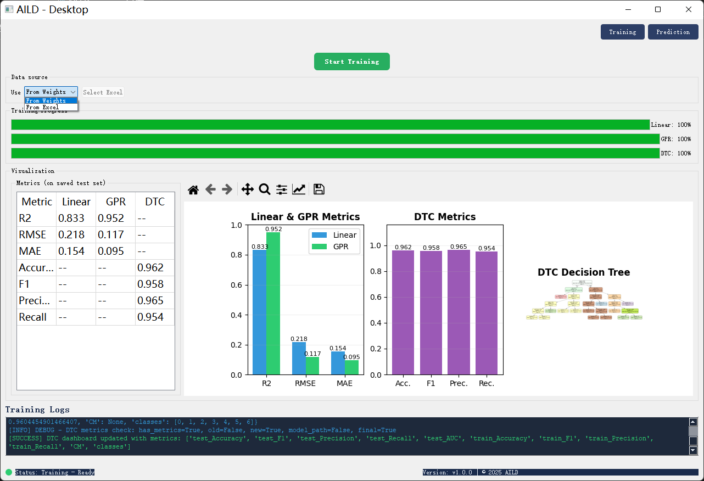

# AILD: 逻辑描述符人工智能分析系统

[](https://www.python.org/downloads/)
[](https://pypi.org/project/PyQt5/)
[](https://scikit-learn.org/)
[](LICENSE)

> **阅读 [English](README.md)**

一个用于材料科学中逻辑描述符分析的智能桌面应用程序，集成了机器学习模型训练和预测功能，并提供直观的图形用户界面。

## 🚀 主要功能

### 核心功能
- **多模型支持**：线性回归、高斯过程回归(GPR)和决策树分类(DTC)
- **交互式GUI**：基于PyQt5的用户友好界面
- **模型训练**：支持从Excel数据训练或使用预训练权重
- **实时预测**：实时模型推理预测材料属性
- **性能可视化**：全面的指标仪表板和图表
- **模型管理**：版本控制和模型文件管理系统

### 高级功能
- **Bootstrap置信区间**：预测结果的统计置信度分析
- **SHAP值**：特征重要性解释和可解释性分析
- **贝叶斯优化**：决策树模型的超参数调优
- **交叉验证**：鲁棒的模型评估和验证
- **PDF预览**：预测材料类别的可视化预览
- **决策树可视化**：交互式的树结构可视化

## 📋 系统要求

- **Python版本**：3.11 或更高
- **操作系统**：Windows 7/10/11, Linux, 或 macOS
- **内存**：最小2GB (推荐4GB)
- **存储空间**：2GB可用空间用于模型和数据

## 🛠️ 安装指南

### 1. 克隆仓库
```bash
git clone https://github.com/CTX-YOLO/AILD.git
```

### 2. 安装依赖
```bash
conda create -n AILD_env python=3.11.8 -y
conda activate AILD_env
pip install -r requirements.txt
```

### 3. 安装Graphviz (用于决策树可视化)
- **Windows**：从 [Graphviz官网](https://graphviz.org/download/) 下载（注意设置环境变量） 或者使用包管理器下载 `winget install Graphviz.Graphviz --source winget`
- **Ubuntu/Debian**：`sudo apt-get install graphviz`
- **macOS**：`brew install graphviz`

## 📖 使用方法

### GUI模式 (推荐)

1. **启动应用程序**
   ```bash
   python AILD.py
   ```

2. **训练标签页**：
   - 选择数据源："From Excel" 或 "From Weights"
   - 选择Excel文件 (如果使用Excel数据)
   - 点击 "Start Training" 开始训练模型
   - 实时监控进度并查看指标


3. **预测标签页**：
   - 选择模型类型 (linear、gpr、dtc 或 all)
   - 选择模型版本
   - 输入特征值或使用示例值
   - 点击 "Run Prediction" 获取即时结果


### 命令行模式

#### 训练模型
```bash
# 训练所有模型
python Train_and_Predictor.py --task all --mode train --excel-path your_data.xlsx

# 训练特定模型
python Train_and_Predictor.py --task linear --mode train --excel-path your_data.xlsx
python Train_and_Predictor.py --task gpr --mode train --excel-path your_data.xlsx
python Train_and_Predictor.py --task dtc --mode train --excel-path your_data.xlsx
```

#### 进行预测
```bash
# 使用特定模型预测
python Train_and_Predictor.py --task linear --mode predict --values "2.7597,-1.3566,7.0,3.1857,1.5862,0.2068"

# 使用所有模型预测
python Train_and_Predictor.py --task all --mode predict --values "2.7597,-1.3566,7.0,3.1857,1.5862,0.2068"
```

## 📊 数据格式

### 输入特征 (6个特征)
- `length`：平均配位键长
- `a_M1_dz2`：中心吸附原子dz2轨道中
- `num`：中心吸附原子第一配位数
- `a_M2_s`：中心吸附原子s轨道带宽
- `a_M3_dxz`：中心吸附原子 dxz轨道偏度
- `c_Rs_dz2`：第一配位原子dz2轨道电子贡献率

### 训练数据格式 (Excel)
| length | a_M1_dz2 | num | a_M2_s | a_M3_dxz | c_Rs_dz2 | E_ad | cluster (可选) |
|--------|----------|-----|--------|----------|----------|------|----------------|
| 2.7597 | -1.3566  | 7.0 | 3.1857 | 1.5862   | 0.2068   | 1.23 | 1              |

### 预测输入格式
逗号或空格分隔的值，按以下顺序：
```
length,a_M1_dz2,num,a_M2_s,a_M3_dxz,c_Rs_dz2
```
示例：`2.7597,-1.3566,7.0,3.1857,1.5862,0.2068`

## 🏗️ 项目结构

```
AILD/
├── AILD.py                    # 主GUI应用程序
├── Train_and_Predictor.py      # 命令行训练和预测脚本
├── requirements.txt           # Python依赖包列表
├── README.md               # 英文文档
├── README_CN.md               # 中文文档
└── artifacts/                 # 模型文件和权重
    ├── default_weights_files/ # 预训练模型
    └── user_*/                # 用户训练的模型版本
```

## 🔬 模型概览

### 1. 线性回归 (Linear Regression)
- **用途**：预测连续目标值 (如吸附能)
- **特点**：方程生成、置信区间
- **输出**：预测值及不确定性范围

### 2. 高斯过程回归 (GPR)
- **用途**：带不确定性量化的概率预测
- **特点**：标准差输出、基于核的学习
- **输出**：预测值及置信区间

### 3. 决策树分类 (DTC)
- **用途**：将材料分类到离散类别
- **特点**：贝叶斯优化、决策路径可视化
- **输出**：类别概率和预测类别

## 📈 性能指标

### 回归模型 (线性 & GPR)
- **R²分数**：决定系数
- **RMSE**：均方根误差
- **MAE**：平均绝对误差
- **置信区间**：95% Bootstrap置信区间

### 分类模型 (DTC)
- **准确率**：整体分类准确率
- **F1分数**：精确率和召回率的调和平均值
- **精确率**：阳性预测准确率
- **召回率**：敏感度/真阳性率
- **AUC**：ROC曲线下的面积

## 🎯 核心功能说明

### 模型版本管理
- 新训练会话自动创建版本
- 用户模型不可用时回退到默认权重
- 带元数据的持久化文件存储

### 实时可视化
- 基于matplotlib的交互式指标仪表板
- 使用Graphviz的决策树可视化
- 类别特定PDF预览功能
- 可缩放和平移的图形视图

### 健壮的错误处理
- 模型不可用时的优雅降级
- 全面的日志记录和用户反馈
- 输入验证和类型检查

## 🤝 贡献指南

1. Fork 本仓库
2. 创建功能分支 (`git checkout -b feature/AmazingFeature`)
3. 提交更改 (`git commit -m 'Add some AmazingFeature'`)
4. 推送到分支 (`git push origin feature/AmazingFeature`)
5. 开启 Pull Request

## 📝 许可证

本项目采用 MIT 许可证 - 查看 [LICENSE](LICENSE) 文件了解详情。

## 🙏 致谢

- 使用 PyQt5 构建桌面界面
- 由 scikit-learn 提供机器学习算法支持
- matplotlib 和 Graphviz 提供可视化支持
- SHAP 集成实现模型可解释性

## 📞 技术支持

如果您遇到问题或有疑问：
1. 查看 [Issues](../../issues) 页面
2. 创建新问题并详细描述
3. 包含您的Python版本、操作系统和错误信息

---

**AILD** - 通过智能机器学习推动材料科学进步
